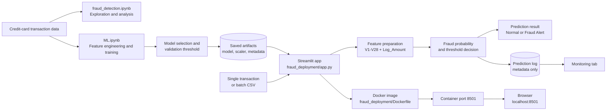

# System Architecture

## Component Responsibilities

| Component | Responsibility |
| --- | --- |
| `fraud_detection.ipynb` | Explore the transaction data and investigate fraud patterns. |
| `ML.ipynb` | Train candidate models, evaluate them, and select the deployment model and threshold. |
| Saved artifacts | Preserve the model, `Log_Amount` scaler, feature order, model version, and threshold used by the app. |
| `fraud_deployment/app.py` | Validate inputs, prepare features, run inference, display results, and record prediction metadata. |
| Prediction log | Store timestamp, model version, probability, predicted class, and an input hash without raw transaction values. |
| Docker image | Package the Streamlit runtime and deployment files for repeatable execution. |

## Prediction Flow

1. A user enters one transaction or uploads a CSV.
2. The app validates `Amount` and `V1` through `V28`.
3. `Log_Amount = log1p(Amount)` is calculated and transformed with the saved scaler.
4. Features are reordered to match the saved metadata.
5. The model produces a fraud probability.
6. The saved validation threshold converts the probability into `Normal` or `Fraud Alert`.
7. Prediction metadata is appended to the local monitoring log.